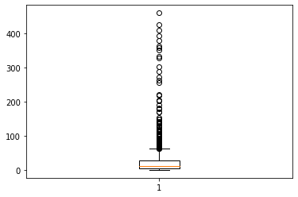

***My task is to predict the number of dengue cases each week (in each location) based on environmental variables describing changes in temperature, precipitation, vegetation, and more.***

## **Comprehending and pre-processing data-**
The raw dataset cannot be used directly to build predictive models. Therefore, we have performed some operations to make the dataset efficient for building the model and better comprehension. Also,  explored the data to discern the statistics of the whole dataset as well as the variables and also understand the correlation among the variables. Undertook feature engineering to develop better models.
**Data Cleaning-**
The raw training dataset consisted of around 550 total null values. Since our dataset was small with 1456 total records and being a time series dataset, we cannot just drop the records with null values. Therefore, we used the python function ‘fillna’ with the method ‘ffill’ to replace the null values. Moreover, dropped the columns that are not useful.
Lastly, since our dataset consists of 2 cities, for which the data-type is object, converted the city column to int by assigning 0 to city “sj” and 1 to city “iq”.
**Exploratory data analysis-**
To interpret the distribution of total weekly dengue cases, plotted the following histogram.

The histogram is skewed to the right side. Mean=24.67 and Variance=43.59

Following is the graphical display of the correlation matrix-

Based on this corrplot, we deduced that there is no strong correlation of total cases to other feature variables provided.
Furthermore, plotting the boxplot to comprehend the statistical distribution and the outliers. 

This boxplot depicts the high quantity of outliers. These outliers play a pivotal role in the decision-making of the organization. Owing to these outliers, QuantumData suggested considering MSE(Mean Squared Error) as the key performance metric, but PATH was adamant about considering MAE(Mean Absolute Error).
**Data Scaling-**
In the provided dataset, there is a difference in units of quantities measuring the same parameter. For example, the temperature is measured in kelvin for some variables while in degree celsius for some variables. In order to avert this discrepancy and make sure that this does not affect our model, we scaled the data using the function MinMaxScaler().
**Feature engineering-**
The first engineered feature is vegetation. The provided dataset consists of data about the vegetation based on 4 regional directions. We engineered a feature that aggregates these 4 different columns by taking their average.
The second engineered feature is the month and it’s transformation. The 2 cities, Sa Juan and Iquitos lie in different hemispheres. This results in seasonal differences and we as climate is an important factor that has an impact on the number of cases. The following graph shows that the highs and lows of ‘SJ’ are approximately 4 month apart from highs and lows of ‘IQ’.

                                                                           

‘SJ’ month-wise total case distribution           

                                                                           

‘IQ’ month-wise total case distribution
Therefore we transformed these months in a way that the highs and lows of ‘SJ’ approximately coincide with the highs and lows of ‘IQ’.
 
##Training and testing of models.
Initially, we split our data to train(80%) and test(20%) using the train_test_split function.

**Generalized linear model(Gamma distribution)-**
The gamma distribution is a continuous probability distribution that is used to model the time between events in a Poisson process, or the size of an object that is created by a Poisson process. Looking at the graph in figure 3.1, the distribution of total cases resembles gamma distribution. Therefore we trained a Gamma GLM and then tested our model on the test data. Our model generated MAE(Mean absolute error) as 19.3869.

**Generalized linear model(Negative Binomial distribution)-**
In a Generalized Linear Model (GLM), the negative binomial distribution is often used as the response distribution when the dependent variable is a count variable that exhibits overdispersion, which means that the variance of the variable is larger than the mean. Here, mean and variance of total cases is 24.67 and 1900 respectively. Therefore, we trained the negative binomial model and then tested the model to generate MAE(Mean absolute error) as 16.979.

**Random Forest (bagging)-**
The prediction we are making are highly dependent on climatic factors. These climatic factors interact with each other deeply and linear models are unable to capture these interactions. Therefore we move on to Non-linear models with the first one being random forest(bagging). Bagging is an ensemble learning method that combines multiple decision trees to create a single model. It works by training a large number of decision trees on random subsets of the training data, and then averaging the predictions of all the trees to make a final prediction. We trained the random forest model taking the number of estimators as 500. Tested the model to obtain the MAE(Mean absolute error) as 11.6609. The graph below shows the importance of each feature considered by the random forest algorithm.  

                                                                           

**Random Forest (Gradient Boosting)-**
Gradient Boosting (GB) is a machine learning technique that combines multiple weak models to create a single, more powerful model. It is a type of ensemble learning, which is a method of combining multiple models to improve the predictive accuracy of a model. We trained the random forest model taking the number of estimators as 5000 and learning rate as 0.1. Tested the model to obtain the MAE(Mean absolute error) as 11.2089.
The graph below shows the importance of each feature considered by the Gradient Boosting algorithm. 

                                                                           

**Backward selection-**
Backward selection algorithm eliminates features based on their p-value. After running backward selection, only one variable was eliminated which states that all other variables depict a significant p-value. This output did not result in any fruition for our analysis.

** Splitting up the dataset-**
We split up the dataset with respect to the cities. One dataframe consisted of 936 records for the city  ‘SJ’ and other consisted of 520 records for the city ‘IQ’.  The ran the same models on both the datasets and generated the following results.
Model
MAE(Mean Absolute Error) after data split
GLM (Gamma distribution)
28.967
GLM (Negative Binomial distribution)
18.2893
Random Forest(bagging)
12.823
Random forest(Gradient Boosting)
12.280

The MAE increased after data split. Therefore, using the whole dataset without split is the better option.

##The Best Approach!
All the models that we deployed for prediction provided us with fairly good values of mean absolute error. Furthermore, Gradient boosting provided us with the least MAE which I consider as the best approach. 
There are several reasons why GB may be better than other benchmark models in some cases:
GB typically has higher prediction accuracy than other benchmark models. This is because GB combines the predictions of multiple weak models in a way that reduces errors and biases, while other models rely on a single model, which can be prone to overfitting and underfitting.
GB is more flexible than other benchmark models. GB allows you to specify the loss function and learning rate, which gives you more control over the model's performance. In contrast, the loss function and learning rate are fixed in other benchmark models, which means you have less control over the model's behavior.
GB can handle non-linear relationships between the dependent and independent variables, while other benchmark models may only be able to model linear relationships. This makes GB more suitable for complex tasks.
GB can handle missing values and handle them well, while other benchmark models may not be able to handle missing values.
It is worth noting that GB is just one of many machine learning techniques, and the choice of which technique to use will depend on the specific task and the available data. In general, GB may be more suitable for tasks that require higher prediction accuracy and the ability to model non-linear relationships, while other benchmark models may be more suitable for tasks based on data size, complexity, speed of computation, and more.

##Conclusion-
Our main purpose of this exploration is to find the best predictor to model the total cases per week in two cities Iquitos and San Juan. Based on the dataset collected from NCEI, and NCAR, we have trained a few models. The models used in this analysis are GLM (gamma distribution), GLM (Negative Binomial distribution), Random forests (bagging), and Random forests (gradient boosting). We have evaluated these models based on the performance metric mean absolute error (MAE). We have built these models with a single dataset for both cities and also split datasets, separate for each city. Random forest with gradient boosting on a single dataset was the best model based on the MAE. 
This model was used by PATH on a test dataset and found that the MAE was 28.6010. Nonetheless, there is always room for improvement. We might further improve the score by including more features like windspeed, population, cyclic climate features (El Niño and La Niña), etc. Not only these, but we could also use prediction models to fill in the missing dataset used for training. These will help us model the cities better to predict the cases.
